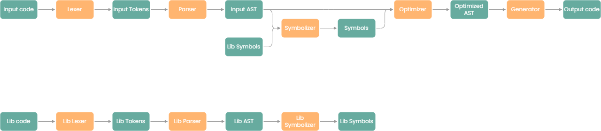

### Lexer
Transform the input into a list of tokens, easier to process. 
For example it can group character together and transform '>' + '=' into '>='

### Parser
Process a list of tokens and transform it into an AST (list of nodes). 

### Symbolizer
Retrieve all the symbols (variable, function, class, interface, prototype) from an AST 
and infer the type of variables. It also

### Optimizer
Check if all the symbol used exists, check the operation, and the integrity of the file. 
Also optimize some expression by removing useless expression.

### Generator
Translate an AST into C.
